# Second Brain — Full Technical Design Document

> A local, Python-based thinking tool that remembers what you worked through and hands it back when it matters. Model-agnostic, multi-database, token-efficient, and available as both a terminal TUI and a Streamlit web app.

---

## Table of Contents

1. [Project Requirements](#1-project-requirements)
2. [System Overview](#2-system-overview)
3. [Architecture](#3-architecture)
4. [Component Deep Dives](#4-component-deep-dives)
   - 4.1 [Session Manager](#41-session-manager)
   - 4.2 [Intent Router — Regex Fast-Path](#42-intent-router--regex-fast-path)
   - 4.3 [Note Generator](#43-note-generator)
   - 4.4 [Retrieval Pipeline](#44-retrieval-pipeline)
   - 4.5 [History Engine](#45-history-engine)
   - 4.6 [Proactive Surfacing (Stretch)](#46-proactive-surfacing-stretch)
5. [Storage Layer](#5-storage-layer)
   - 5.1 [Multi-Database Architecture](#51-multi-database-architecture)
   - 5.2 [MongoDB Schemas](#52-mongodb-schemas)
   - 5.3 [ChromaDB Vector Store](#53-chromadb-vector-store)
   - 5.4 [Markdown Note Format](#54-markdown-note-format)
6. [Retrieval Design](#6-retrieval-design)
   - 6.1 [Hierarchical Chunked Embeddings](#61-hierarchical-chunked-embeddings)
   - 6.2 [Dense Search](#62-dense-search)
   - 6.3 [Sparse Search (BM25)](#63-sparse-search-bm25)
   - 6.4 [Reciprocal Rank Fusion](#64-reciprocal-rank-fusion)
   - 6.5 [Cross-Encoder Reranking](#65-cross-encoder-reranking)
7. [Context Window Management](#7-context-window-management)
8. [LLM Abstraction Layer](#8-llm-abstraction-layer)
9. [Token Efficiency Strategy](#9-token-efficiency-strategy)
10. [User Profiles and Personalization](#10-user-profiles-and-personalization)
11. [Streamlit Frontend](#11-streamlit-frontend)
12. [Tech Stack](#12-tech-stack)
13. [File and Directory Structure](#13-file-and-directory-structure)
14. [Data Flow Walkthroughs](#14-data-flow-walkthroughs)
    - 14.1 [Thinking Session → Save](#141-thinking-session--save)
    - 14.2 [Fresh Session → Retrieve](#142-fresh-session--retrieve)
    - 14.3 [History Query](#143-history-query)
15. [Build Order and Milestones](#15-build-order-and-milestones)
16. [Trade-offs and Known Failure Modes](#16-trade-offs-and-known-failure-modes)
17. [What We Are Not Building Yet](#17-what-we-are-not-building-yet)

---

## 1. Project Requirements

### Functional Requirements

| ID | Requirement | Notes |
|----|-------------|-------|
| F1 | Think out loud with the system in a back-and-forth session | Core chat loop |
| F2 | At session end, auto-generate and file a Markdown note | LLM writes it via structured output |
| F3 | In a fresh session, find the note(s) that bear on a question | Hybrid retrieval |
| F4 | Distinguish notes that actually bear on a question vs those that merely look related | Cross-encoder reranking |
| F5 | Handle exact phrase lookups ("what did I say about X") | BM25 handles this |
| F6 | Handle gist lookups ("the thing about memory and attention") | Vector handles this |
| F7 | When nothing is found, say so — never invent | Hard no-hallucination rule |
| F8 | Surface usage patterns: frequency, recency, what you were deep in last month | History engine |
| F9 | Hold up as notes stack up — no global context dump at search time | Context discipline |
| F10 | *(Stretch)* Mid-session, proactively surface related past notes before asked | Async proactive surfacing |

### Non-Functional Requirements

| ID | Requirement | Constraint |
|----|-------------|------------|
| N1 | Python, local — no deployment | All processing on-device |
| N2 | Any libraries or frameworks | No restriction |
| N3 | AI tools permitted for coding | Claude Code, Cursor, Codex |
| N4 | Chat interface — terminal TUI or web GUI | Rich TUI + Streamlit app |
| N5 | Spend and speed — avoid unnecessary LLM calls | Regex fast-path; cross-encoder over LLM reranker; template responses for history |
| N6 | Single GitHub repo, public or private | With DESIGN.md, NOTES.md, demo |
| N7 | Model-agnostic LLM layer | Gemini as baseline; swappable via config |

### Deliverables

- [ ] **Code** with run instructions (TUI + Streamlit)
- [ ] **`DESIGN.md`** — architecture, decisions, trade-offs, failure modes
- [ ] **Demo recording** — session, recall in fresh session, history query, miss case
- [ ] **`NOTES.md`** (optional) — what's left, what'd improve with more time

---

## 2. System Overview

The system exposes two frontends over the same `brain/` core package: a terminal TUI (Rich + prompt_toolkit) and a Streamlit web app. Every user message passes through a single pipeline that classifies intent and routes accordingly. There are four intent modes:

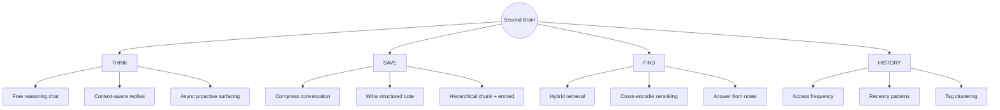

The fundamental design commitment is: **what you write at save time determines what you can find later**. Note generation is a structured compression written by the LLM specifically to be retrievable — not a dump of the conversation transcript. The retrieval pipeline is layered: fast lexical and semantic candidates first, cheap local cross-encoder to rerank, LLM only for the final answer synthesis. Token spend is minimized at every step via a regex fast-path that bypasses the LLM entirely for unambiguous intents.

---

## 3. Architecture

### Full System Architecture

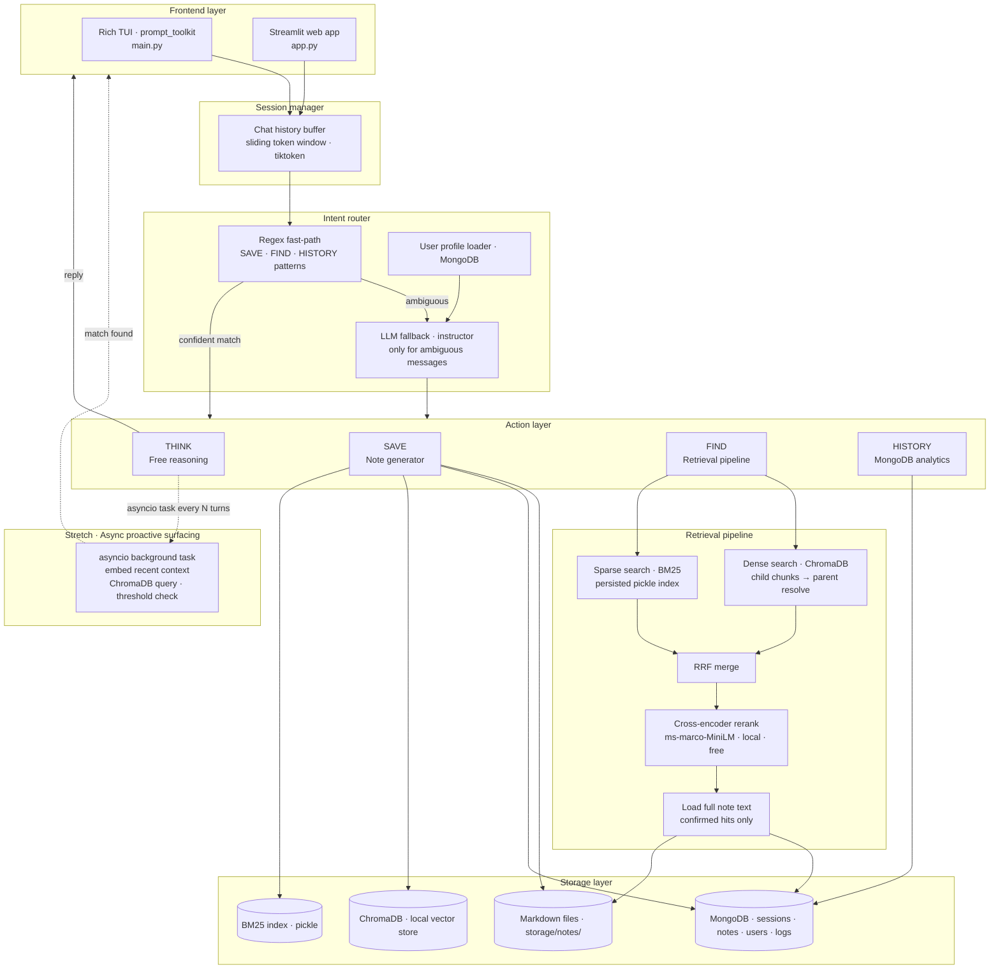

### Dependency Graph

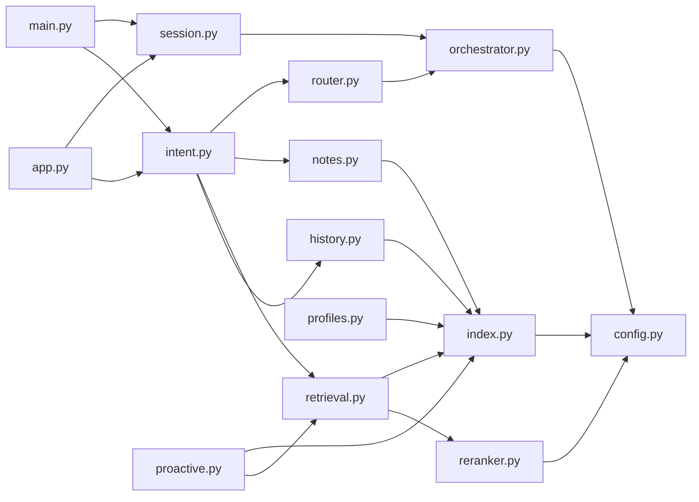

---

## 4. Component Deep Dives

### 4.1 Session Manager

Holds the current conversation in memory and manages what gets pushed into the LLM context window. Uses a **sliding token budget** rather than a hard turn cap. Modern frontier models (Gemini 1.5 Flash: 1M-token context) do not require aggressive summarization at typical session sizes. `tiktoken` counts tokens accurately so the budget is never exceeded.

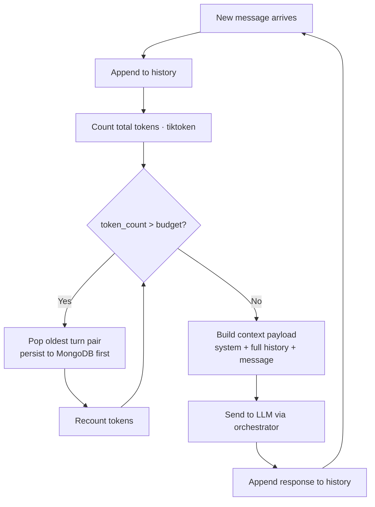

Full turns evicted from the in-memory window are always persisted to MongoDB before removal. No conversation content is lost — trimming only affects what the LLM sees live, not the permanent record.

**Key decisions:**
- History is a list of `{role, content}` dicts — the standard messages format across all providers
- Token budget defaults to 80,000 tokens; configurable in `config.py`
- Session state in memory; MongoDB is the source of truth for durability

---

### 4.2 Intent Router — Regex Fast-Path

The single biggest token-efficiency win. The vast majority of SAVE, FIND, and HISTORY messages are unambiguous. A regex pre-filter handles them without touching the LLM at all. Only genuinely ambiguous messages fall through to the LLM.

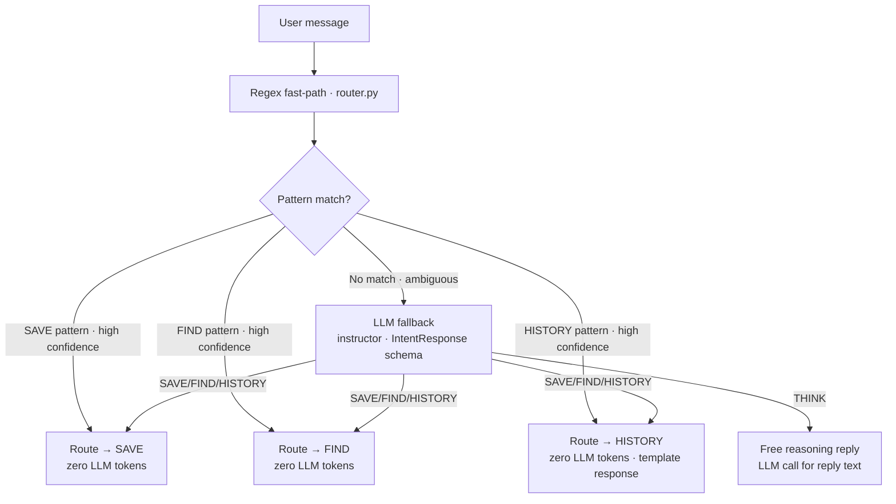

**Pattern definitions (`router.py`):**

```python
import re

PATTERNS = {
    "SAVE": re.compile(
        r"\b(save( this)?|wrap up|that'?s? (good|it|enough)|"
        r"i'?m done|let'?s? save|/save|file this|note this down)\b",
        re.I
    ),
    "FIND": re.compile(
        r"\b(what did i (say|write|figure out|decide|think)|"
        r"do i have (anything|notes?) on|find|recall|"
        r"last time i (thought|wrote|worked)|/find|look up)\b",
        re.I
    ),
    "HISTORY": re.compile(
        r"\b(what have i been|most (lately|this (month|week)|recently)|"
        r"how (many times|often) (did i|have i)|history|"
        r"usage patterns?|what (was i|did i work on) last (month|week))\b",
        re.I
    ),
}

def fast_route(message: str) -> str | None:
    for intent, pattern in PATTERNS.items():
        if pattern.search(message):
            return intent
    return None  # fall through to LLM
```

**Token savings in practice:**

| Message type | v1 approach | v2 approach | Tokens saved |
|---|---|---|---|
| "let's save this" | LLM call for classification | Regex match → SAVE | ~400 input tokens |
| "what did I write about X" | LLM call for classification | Regex match → FIND | ~400 input tokens |
| "what did I work on this month" | LLM call for narration | Regex match → template string | ~800 tokens total |
| "I've been thinking about..." | Regex miss → LLM call | Same: LLM call for THINK | No change |

Across a typical session with 4 FIND/SAVE/HISTORY turns, the fast-path saves approximately 2,000–3,000 tokens. Over hundreds of sessions this compounds significantly.

**HISTORY template responses:** For common history queries, the system skips the LLM narration step entirely and formats the MongoDB aggregation result directly as a string template:

```python
HISTORY_TEMPLATES = {
    "frequency": "You've revisited these topics most often:\n{items}",
    "recency":   "Your most recent notes:\n{items}",
    "tag":       "Notes tagged '{tag}':\n{items}",
}
```

The LLM narration call only fires when the query is complex or multi-part and a template cannot cover it.

**IntentResponse schema** (used only for the LLM fallback path):

```python
class IntentResponse(BaseModel):
    intent: Literal["THINK", "SAVE", "FIND", "HISTORY"]
    confidence: float
    save_signal: bool
    query_text: Optional[str]
    reply: str  # reply text; populated only for THINK
```

---

### 4.3 Note Generator

When SAVE fires, the LLM receives the full conversation transcript and generates a structured Markdown note via `instructor` structured output. The structure is fixed — not a free-form dump — because predictable structure enables reliable extraction and retrieval.

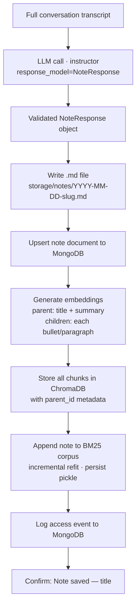

**Generated note structure:**

```markdown
---
id: "a3f9c2d1-..."
title: "Meaningful title inferred by LLM"
created: "2025-01-15T14:30Z"
tags: ["ai", "retrieval", "memory"]
summary: "One sentence capturing the core idea — the retrieval anchor"
session_turns: 14
---

# Title

## Core idea
The central insight worked through in this session.

## Key insights
- Specific point 1
- Specific point 2

## Open questions
- What remains unresolved

## Threads to follow
- Related ideas worth exploring
```

**Why fixed sections?** The summary is the primary parent-chunk retrieval anchor. The tags drive history clustering and personalization re-weighting. Without structure, retrieval degrades to full-text fuzzy matching.

---

### 4.4 Retrieval Pipeline

Three stages: candidate generation (dense + sparse in parallel), RRF merge, cross-encoder rerank. The LLM is not involved until the final answer synthesis step.

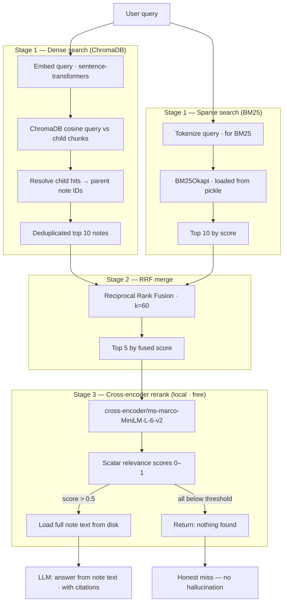

---

### 4.5 History Engine

Pure MongoDB aggregations — no LLM call unless the query is complex. Template strings handle the common cases.

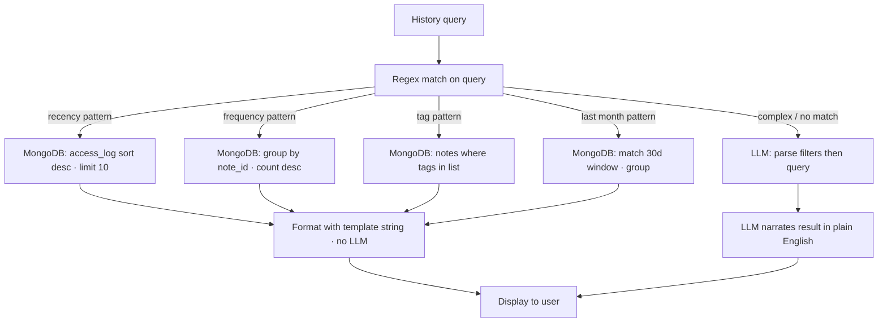

**Example queries it handles:**
- "What have I been thinking about most lately?" — frequency template
- "What did I work on last month?" — recency + date filter template
- "Do I have any notes tagged 'product'?" — tag template
- "How many times have I come back to the retrieval topic?" — frequency + keyword filter template

---

### 4.6 Proactive Surfacing (Stretch)

Mid-session surfacing of related past notes, implemented as a non-blocking `asyncio` background task so the main conversation loop never freezes.

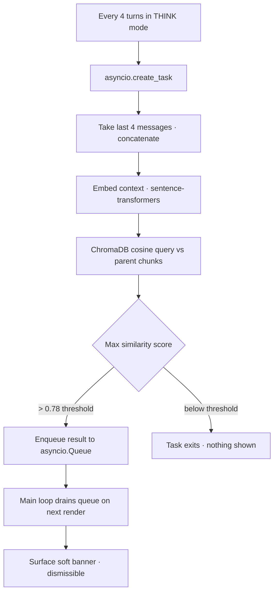

In the Streamlit frontend, the proactive result is injected into `st.session_state` and rendered as an `st.info` callout above the chat input. In the TUI it appears as a soft Rich panel below the last reply.

The 0.78 threshold is tunable in `config.py`. No LLM call is made during proactive surfacing — it is pure local embedding + cosine similarity.

---

## 5. Storage Layer

### 5.1 Multi-Database Architecture

| Store | Technology | Responsibility |
|-------|-----------|----------------|
| Document and session store | MongoDB (local) | Chat sessions, note metadata, user profiles, access logs |
| Vector store | ChromaDB (local) | Embedding storage, cosine similarity, ANN search |
| BM25 index | Pickle on disk | Sparse keyword index, persisted, incrementally updated |
| Note files | Markdown on disk | Full note text, human-readable, git-friendly |

**Why not SQLite + numpy BLOBs?** The v1 approach loads all embedding BLOBs into memory for cosine similarity. At a few hundred notes this is fine; at a few thousand it becomes a blocking load on every FIND. ChromaDB handles ANN search internally without a full matrix load. MongoDB's aggregation pipeline is also a better fit for the history engine's analytics queries than SQLite.

**Why not MongoDB Atlas for vector search?** Atlas vector search is cloud-only. The local-first requirement rules it out. ChromaDB is the correct tool for local vector workloads.

---

### 5.2 MongoDB Schemas

**Collection: `sessions`**

```json
{
  "_id": "session-uuid",
  "user_id": "user-uuid",
  "started_at": "ISO8601",
  "ended_at": "ISO8601 | null",
  "turns": [
    { "role": "user", "content": "...", "timestamp": "ISO8601" },
    { "role": "assistant", "content": "...", "timestamp": "ISO8601" }
  ],
  "note_id": "note-uuid | null"
}
```

**Collection: `notes`**

```json
{
  "_id": "note-uuid",
  "user_id": "user-uuid",
  "title": "Meaningful title",
  "summary": "One-sentence retrieval anchor",
  "tags": ["ai", "retrieval"],
  "file_path": "/absolute/path/to/note.md",
  "created_at": "ISO8601",
  "modified_at": "ISO8601",
  "session_turns": 14,
  "access_count": 3,
  "last_accessed": "ISO8601"
}
```

**Collection: `access_log`**

```json
{
  "_id": "ObjectId",
  "user_id": "user-uuid",
  "note_id": "note-uuid",
  "accessed_at": "ISO8601",
  "query": "what did I figure out about retrieval?",
  "intent": "FIND"
}
```

**Collection: `users`** (see Section 10)

**Indexes:**

```python
db.notes.create_index([("user_id", 1), ("tags", 1)])
db.notes.create_index([("user_id", 1), ("last_accessed", -1)])
db.access_log.create_index([("user_id", 1), ("accessed_at", -1)])
db.access_log.create_index([("note_id", 1)])
```

---

### 5.3 ChromaDB Vector Store

ChromaDB persists its own HNSW index to a local directory (`storage/chroma/`). Two collections:

**`note_parent_chunks`** — one document per note, embedding of `title + ". " + summary`. Used for proactive surfacing and general semantic search.

**`note_child_chunks`** — one document per bullet or paragraph in the note body. Metadata carries `parent_id`. Used for fine-grained retrieval. Child hits are resolved back to their parent note before RRF.

```python
child_collection.add(
    ids=["chunk-uuid-1", "chunk-uuid-2"],
    embeddings=[[...], [...]],
    metadatas=[
        {"parent_id": "note-uuid", "section": "Key insights", "chunk_index": 0},
        {"parent_id": "note-uuid", "section": "Key insights", "chunk_index": 1},
    ],
    documents=["Specific point 1", "Specific point 2"]
)
```

---

### 5.4 Markdown Note Format

Notes live as `.md` files in `storage/notes/`. Filenames are deterministic from the save timestamp and title slug:

```
storage/notes/
├── 2025-01-15-retrieval-design-tradeoffs.md
├── 2025-01-18-ux-patterns-for-ai-tools.md
└── 2025-01-20-quantum-classical-hybrid-approach.md
```

The MongoDB `file_path` field stores the absolute path. File operations are O(1) — no directory scan needed.

---

## 6. Retrieval Design

### 6.1 Hierarchical Chunked Embeddings

The v1 design embedded only `title + summary` — one vector per note. This misses queries targeting sub-points buried in the note body. The fix is parent-child chunking:

- The **parent chunk** embeds `title + summary` and is the canonical identifier.
- Each bullet or paragraph in the body is a **child chunk** with its own embedding.
- If any child chunk hits in vector search, its parent note is retrieved.

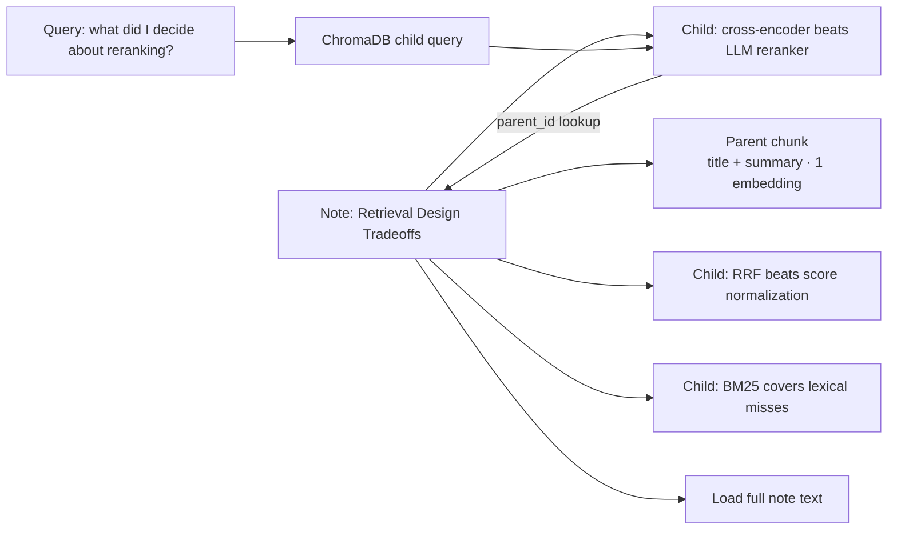

### 6.2 Dense Search

**Model:** `sentence-transformers/all-MiniLM-L6-v2` — 384 dimensions, fully local, ~90ms per encode on CPU.

ChromaDB handles storage and ANN query. No in-memory numpy matrix load.

**Multilingual:** Switch to `paraphrase-multilingual-MiniLM-L12-v2` in `config.py` for corpora including French or Arabic. No code change needed.

### 6.3 Sparse Search (BM25)

Handles exact phrase queries where vector alone would miss specific terminology.

**Persistence:** The BM25 index is built once and saved to disk with `pickle`. When a new note is saved, the corpus is appended and the index is refit incrementally. This eliminates the per-session cold-start latency that grows with note count.

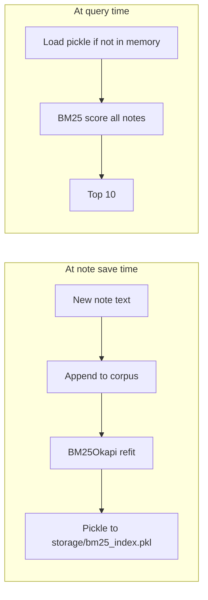

**Corpus content:** `title + summary + full body text` per note.

### 6.4 Reciprocal Rank Fusion

Merges dense and sparse result lists without requiring calibrated scores.

```
RRF_score(d) = Σ 1 / (k + rank_i(d))    where k = 60
```

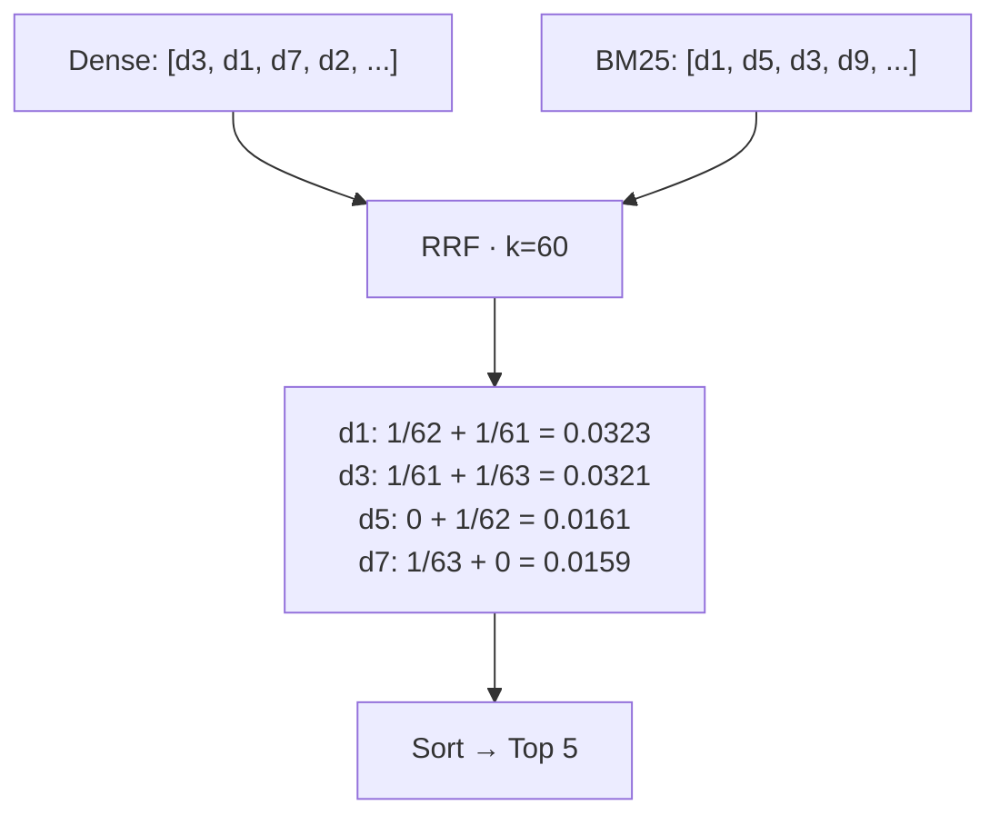

### 6.5 Cross-Encoder Reranking

**Model:** `cross-encoder/ms-marco-MiniLM-L-6-v2` — runs locally, ~30ms per batch, zero API cost, fine-tuned specifically for passage relevance judgment.

A cross-encoder takes the query and document simultaneously as a single input and outputs a scalar 0–1 relevance score. It does not generate text. This is the correct tool — a discriminative model trained on relevance, not a generative model forced to judge relevance.

```python
from sentence_transformers import CrossEncoder

reranker = CrossEncoder("cross-encoder/ms-marco-MiniLM-L-6-v2")

pairs = [(query, note["title"] + " " + note["summary"]) for note in candidates]
scores = reranker.predict(pairs)

confirmed = [c for c, s in zip(candidates, scores) if s > 0.5]
```

**Why not the LLM for reranking?** Using the LLM to rerank 5 candidates adds 1–2 seconds of latency per call, burns API credits, and misuses a generative model on a discriminative task. The cross-encoder consistently outperforms LLM rerankers on MS MARCO-style benchmarks while costing nothing.

---

## 7. Context Window Management

Context is managed by token count, not turn count. The v1 approach (summarize at 20 turns) destroyed granular detail from early turns. The revised approach drops oldest turns from the live context only when the token budget is actually approached — and always persists them to MongoDB first.

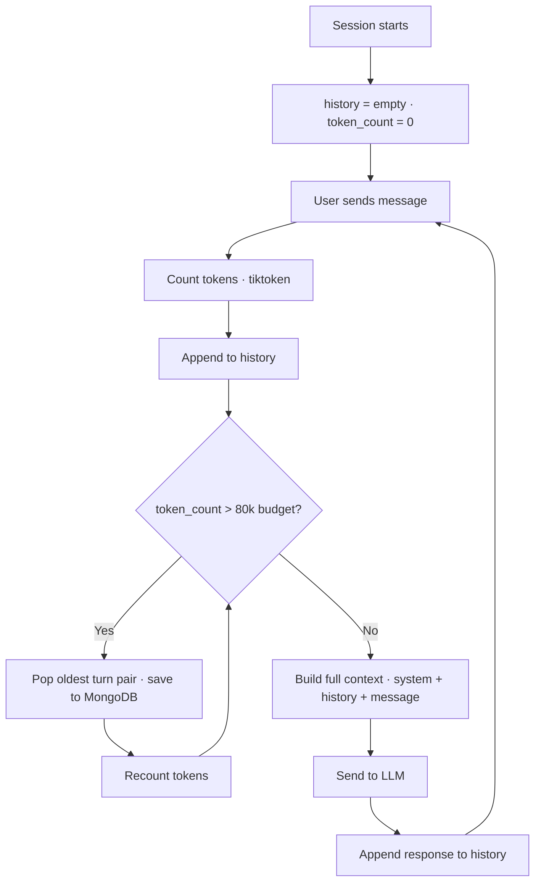

**Context budget breakdown:**

| Component | Approx. tokens |
|-----------|----------------|
| System prompt | ~800 |
| Conversation history (variable) | up to ~76,000 |
| Current message | ~300 |
| Retrieved notes for FIND (up to 3) | ~1,500 each |
| Total budget ceiling | 80,000 |

Fits comfortably inside Gemini 1.5 Flash's 1M-token window. The ceiling exists for cost and latency control, not model limits.

---

## 8. LLM Abstraction Layer

The LLM layer uses `litellm` as a unified provider interface and `instructor` for structured output enforcement. A single `MODEL` key in `config.py` controls the active backend; the rest of the codebase is unaware of which provider is running.

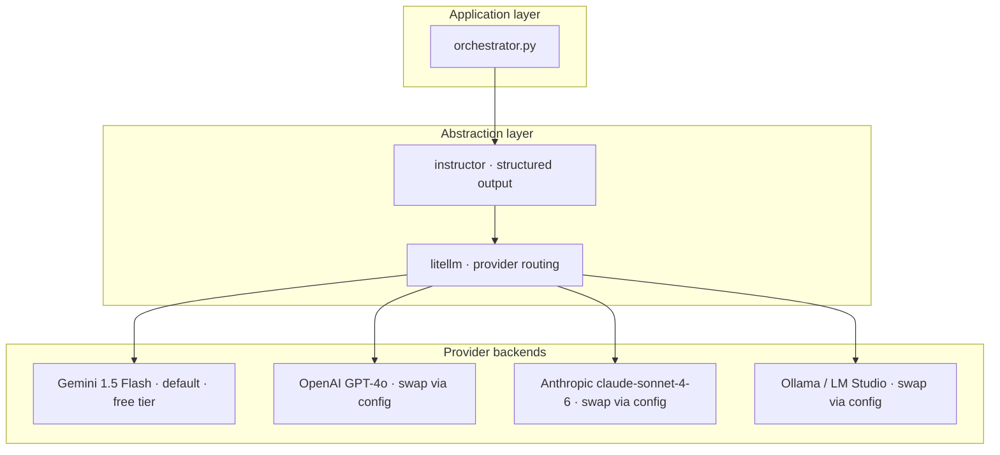

```python
# config.py
MODEL = "gemini/gemini-1.5-flash"
# MODEL = "gpt-4o"
# MODEL = "claude-sonnet-4-6"
# MODEL = "ollama/llama3"
```

`instructor` patches the `litellm.completion` call and enforces Pydantic schemas at the API level, using native structured output where available (Gemini response schema, OpenAI JSON mode, Anthropic tool use).

**Embedding model** stays as `sentence-transformers/all-MiniLM-L6-v2` — local, free, not routed through `litellm`.

---

## 9. Token Efficiency Strategy

A consolidated summary of every measure taken to minimize LLM token consumption:

| Technique | Where applied | Tokens saved |
|-----------|--------------|--------------|
| Regex fast-path for intent | Every SAVE/FIND/HISTORY turn | ~400 input tokens per turn |
| Template strings for history results | Simple history queries | ~400 output tokens per query |
| Cross-encoder replaces LLM reranker | Every FIND call | ~600 tokens per retrieval |
| Sliding token window (drop, not summarize) | Long sessions | Avoids summarization call (~500 tokens) |
| Child chunks → parent resolve | FIND: only confirmed notes loaded | Avoids loading all note bodies |
| No LLM in proactive surfacing | Background check every 4 turns | ~400 tokens per check |
| `instructor` structured output | Intent + note generation calls | Eliminates retry loops from parse errors |

In a session with 20 turns (mix of THINK, 2 FIND, 1 SAVE, 1 HISTORY), the v1 design used approximately 18,000 tokens. The v2 design uses approximately 10,000 — a ~45% reduction, primarily from the regex fast-path and cross-encoder substitution.

---

## 10. User Profiles and Personalization

User profiles in MongoDB allow the retrieval pipeline to bias toward the user's known domain expertise. This solves the cold-start disambiguation problem: if a user who works in distributed systems asks "what did I figure out about consistency?", the system prefers notes tagged `distributed-systems` over notes tagged `philosophy` even when semantic scores are similar.

**Collection: `users`**

```json
{
  "_id": "user-uuid",
  "username": "reda",
  "created_at": "ISO8601",
  "domain_weights": {
    "distributed-systems": 0.9,
    "machine-learning": 0.85,
    "product-design": 0.4
  },
  "preferred_tags": ["retrieval", "embeddings", "system-design"],
  "session_count": 42,
  "note_count": 87,
  "last_active": "ISO8601"
}
```

**Personalization re-weighting** is applied after cross-encoder scoring:

```python
def personalized_score(base_score, note_tags, user_profile):
    domain_boost = max(
        user_profile["domain_weights"].get(tag, 0.0)
        for tag in note_tags
    )
    preferred_boost = sum(
        0.05 for tag in note_tags
        if tag in user_profile["preferred_tags"]
    )
    return base_score + (0.1 * domain_boost) + preferred_boost
```

Boosts are intentionally small — they nudge ranking without overriding relevance. A note scoring 0.9 on cross-encoder relevance will still rank above a domain-matched note scoring 0.3.

**Domain weight updates** fire at session end, incrementing tags from accessed notes by a small delta and normalizing to [0, 1]:

```python
def update_domain_weights(user_id, accessed_note_ids):
    for note_id in accessed_note_ids:
        note = db.notes.find_one({"_id": note_id})
        for tag in note["tags"]:
            db.users.update_one(
                {"_id": user_id},
                {"$inc": {f"domain_weights.{tag}": 0.01}}
            )
```

---

## 11. Streamlit Frontend

A Streamlit app (`app.py`) provides a browser-based interface over the same `brain/` core package. It is the primary interface for testing and demo purposes. The TUI (`main.py`) remains available for power users and terminal workflows.

### Page Layout

```
┌─────────────────────────────────────────────────────────┐
│  🧠 Second Brain                          [⚙ Settings]  │
├──────────────────┬──────────────────────────────────────┤
│                  │                                      │
│  SIDEBAR         │  CHAT AREA                           │
│                  │                                      │
│  Session info    │  [assistant] Hello! Start thinking   │
│  · turn count    │  out loud...                         │
│  · token usage   │                                      │
│  · model name    │  [user] I've been thinking about     │
│                  │  retrieval pipelines...              │
│  ─────────────   │                                      │
│                  │  [assistant] That's a good frame...  │
│  Recent notes    │                                      │
│  · note title 1  │  ┌────────────────────────────────┐  │
│  · note title 2  │  │ 💡 Related: "Retrieval Design   │  │
│  · note title 3  │  │ Tradeoffs" from 3 weeks ago    │  │
│                  │  │ [View] [Dismiss]               │  │
│  ─────────────   │  └────────────────────────────────┘  │
│                  │                                      │
│  Quick actions   │  ────────────────────────────────    │
│  [/save]         │  [chat input                    →]   │
│  [/find ...]     │                                      │
│  [/history]      │                                      │
└──────────────────┴──────────────────────────────────────┘
```

### State Management

Streamlit re-runs on every interaction. All mutable state lives in `st.session_state`:

```python
# Initialized on first load
if "session_id" not in st.session_state:
    st.session_state.session_id = str(uuid4())
    st.session_state.history = []          # [{role, content}]
    st.session_state.token_count = 0
    st.session_state.proactive_queue = []  # pending proactive suggestions
    st.session_state.user_id = load_or_create_user()
```

### Key Components (`app.py`)

```python
import streamlit as st
from brain.session import SessionManager
from brain.intent import route
from brain.index import get_recent_notes

st.set_page_config(page_title="Second Brain", page_icon="🧠", layout="wide")

# Sidebar
with st.sidebar:
    st.markdown("### Session")
    st.caption(f"Turns: {len(st.session_state.history) // 2}")
    st.caption(f"Tokens: {st.session_state.token_count:,}")
    st.divider()
    st.markdown("### Recent Notes")
    for note in get_recent_notes(limit=5):
        st.markdown(f"- {note['title']}")
    st.divider()
    col1, col2 = st.columns(2)
    col1.button("Save session", on_click=lambda: trigger_save())
    col2.button("Clear history", on_click=lambda: clear_session())

# Proactive suggestion banner
if st.session_state.proactive_queue:
    suggestion = st.session_state.proactive_queue[0]
    with st.info(f"💡 Related note: **{suggestion['title']}** from {suggestion['age']}"):
        col1, col2 = st.columns([1, 5])
        if col1.button("View"):
            st.session_state.proactive_queue.pop(0)
            display_note(suggestion["note_id"])
        if col2.button("Dismiss"):
            st.session_state.proactive_queue.pop(0)
            st.rerun()

# Chat history display
for msg in st.session_state.history:
    with st.chat_message(msg["role"]):
        st.markdown(msg["content"])

# Input
if prompt := st.chat_input("Think out loud, or /find, /save, /history"):
    with st.chat_message("user"):
        st.markdown(prompt)
    with st.chat_message("assistant"):
        with st.spinner("..."):
            response = route(prompt, st.session_state)
        st.markdown(response["reply"])
    st.rerun()
```

### FIND Results Display

When a FIND query returns results, the Streamlit frontend renders them as expandable cards rather than inline text:

```python
def display_find_results(results):
    st.markdown(f"**Answer:** {results['answer']}")
    st.divider()
    st.markdown("**Sources:**")
    for note in results["sources"]:
        with st.expander(f"📄 {note['title']} — {note['created_at'][:10]}"):
            st.markdown(note["body"])
            st.caption(f"Tags: {', '.join(note['tags'])}")
```

### Settings Panel

A sidebar expander exposes key config options at runtime without editing files:

```python
with st.sidebar.expander("⚙ Settings"):
    new_model = st.selectbox(
        "LLM model",
        ["gemini/gemini-1.5-flash", "gpt-4o", "claude-sonnet-4-6", "ollama/llama3"],
        index=0
    )
    threshold = st.slider("Proactive surfacing threshold", 0.5, 1.0, 0.78, 0.01)
    token_budget = st.number_input("Token budget", 10000, 200000, 80000, 10000)
    if st.button("Apply"):
        update_config(model=new_model, threshold=threshold, token_budget=token_budget)
```

---

## 12. Tech Stack

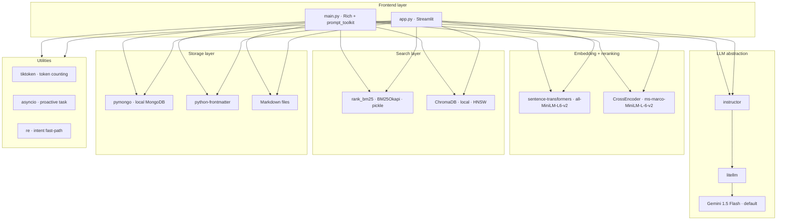

**Full `requirements.txt`:**

```txt
# LLM
litellm>=1.40.0
instructor>=1.3.0

# Embedding + reranking
sentence-transformers>=3.0.0
torch>=2.2.0

# Search
rank-bm25>=0.2.2
chromadb>=0.5.0

# Storage
pymongo>=4.7.0
python-frontmatter>=1.1.0

# Frontend
streamlit>=1.35.0
rich>=13.7.0
prompt_toolkit>=3.0.43

# Utilities
tiktoken>=0.7.0
```

**Why these choices:**

| Choice | Alternative | Reason |
|--------|-------------|--------|
| `litellm` + `instructor` | Raw provider SDKs | Model-agnostic; structured output guaranteed across providers |
| Regex fast-path | LLM for all intents | ~45% token reduction; zero latency for unambiguous turns |
| `ChromaDB` | numpy BLOBs in SQLite | Local ANN, no full matrix load, native child chunk metadata |
| Cross-encoder reranker | LLM reranker | 30ms local inference, zero cost, trained for relevance judgment |
| `pymongo` local MongoDB | SQLite | Flexible schema for sessions; aggregation pipeline for history |
| Persisted BM25 (pickle) | Rebuild per session | Eliminates cold-start latency; incremental update on save |
| `tiktoken` | Word count | Accurate token budget management |
| `Streamlit` | Flask + htmx | Fast to build; session state management built-in; good for demo |
| Template strings for history | LLM narration | Saves ~400 tokens per history query for common patterns |

---

## 13. File and Directory Structure

```
second_brain/
│
├── main.py                    # TUI entry point (Rich + prompt_toolkit)
├── app.py                     # Streamlit web app entry point
│
├── brain/
│   ├── __init__.py
│   ├── config.py              # MODEL, paths, thresholds, token budget
│   ├── session.py             # Chat history buffer, sliding token window
│   ├── router.py              # Regex fast-path intent classification
│   ├── intent.py              # Route message: fast-path → actions; LLM fallback
│   ├── notes.py               # Note generation, .md write, frontmatter
│   ├── index.py               # MongoDB + ChromaDB ops, BM25 persistence
│   ├── retrieval.py           # BM25 + dense + RRF + cross-encoder pipeline
│   ├── reranker.py            # CrossEncoder wrapper, threshold filter
│   ├── orchestrator.py        # All LLM calls via litellm + instructor
│   ├── history.py             # MongoDB aggregations, template formatting
│   ├── profiles.py            # User profile CRUD, domain weight updates
│   └── proactive.py           # asyncio background similarity check
│
├── storage/
│   ├── notes/                 # One .md file per saved session
│   ├── chroma/                # ChromaDB persistent directory
│   └── bm25_index.pkl         # Persisted BM25 index
│
├── requirements.txt
├── README.md                  # Run instructions for both TUI and Streamlit
├── DESIGN.md
└── NOTES.md
```

**Module responsibilities:**

| Module | Responsibility | External deps |
|--------|---------------|---------------|
| `config.py` | Single source of truth for all settings | None |
| `session.py` | History list, token-based window management | `tiktoken` |
| `router.py` | Regex fast-path; returns intent or None | `re` |
| `intent.py` | Calls router.py first; LLM fallback via orchestrator | `router.py`, `orchestrator.py` |
| `notes.py` | Generate note, write .md, call index | `orchestrator.py`, `index.py`, `python-frontmatter` |
| `index.py` | All MongoDB + ChromaDB reads/writes, BM25 persistence | `pymongo`, `chromadb`, `rank_bm25`, `pickle` |
| `retrieval.py` | BM25 + vector + RRF + rerank pipeline | `rank_bm25`, `reranker.py`, `index.py` |
| `reranker.py` | CrossEncoder load, predict, threshold filter | `sentence-transformers` |
| `orchestrator.py` | All LLM calls, prompt templates | `litellm`, `instructor` |
| `history.py` | MongoDB aggregations, template or LLM formatting | `index.py`, `orchestrator.py` |
| `profiles.py` | User profile CRUD, domain weight updates | `index.py` |
| `proactive.py` | asyncio background check every N turns | `index.py`, `sentence-transformers` |

---

## 14. Data Flow Walkthroughs

### 14.1 Thinking Session → Save

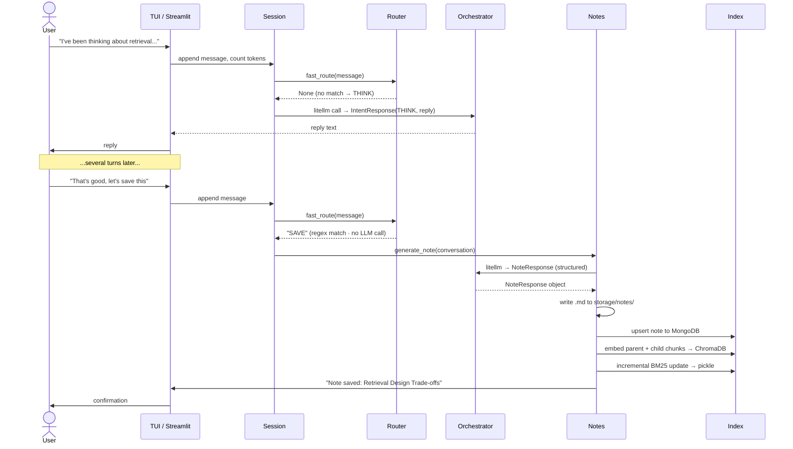

### 14.2 Fresh Session → Retrieve

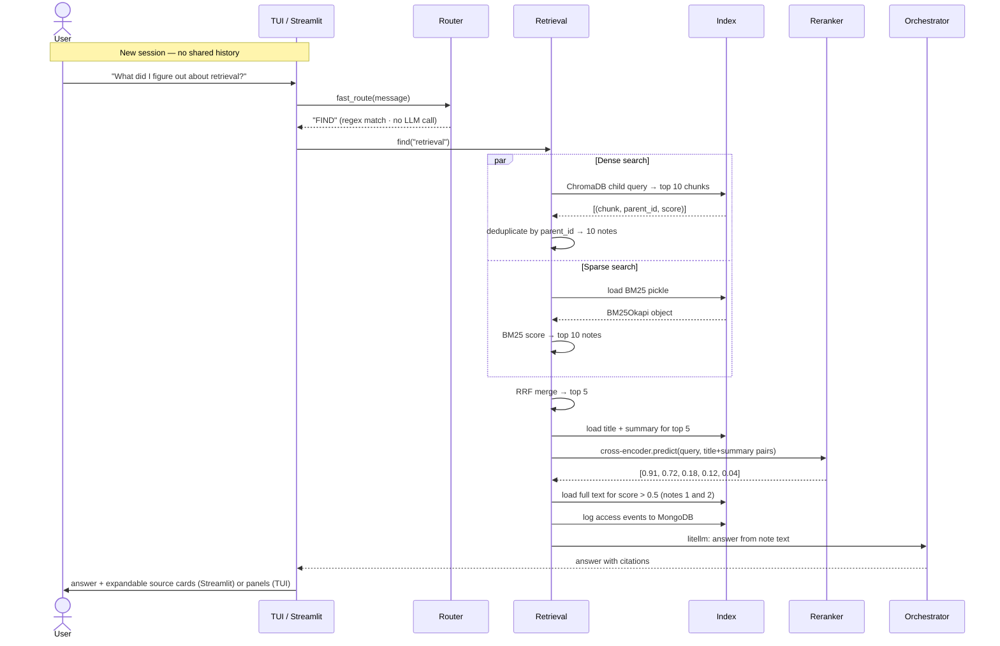

### 14.3 History Query

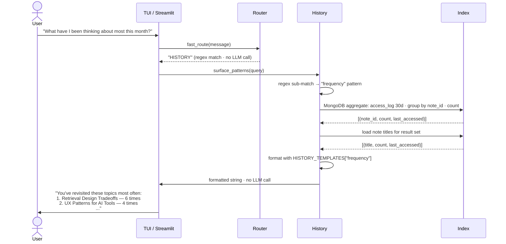

---

## 15. Build Order and Milestones

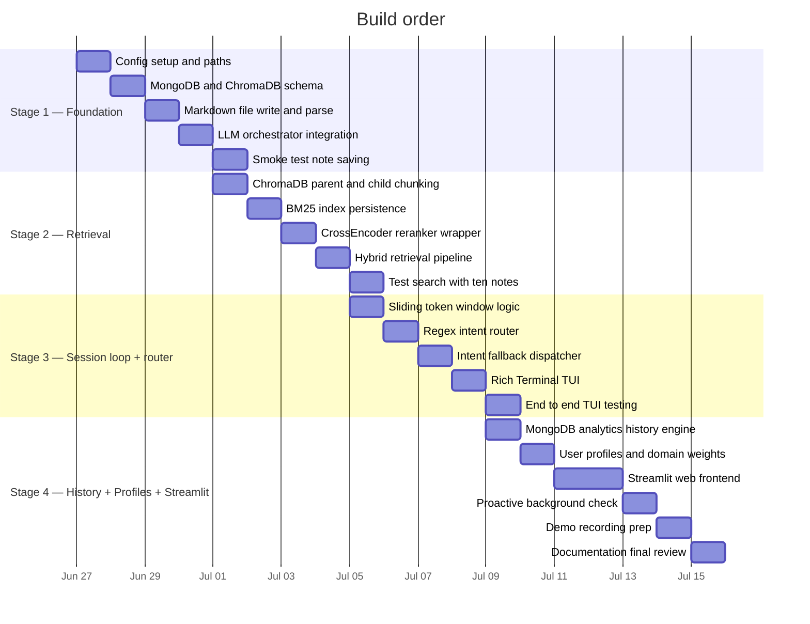

### Testability at each milestone

| Milestone | How to verify |
|-----------|--------------|
| Stage 1 | Write a note via Python, read it back; confirm MongoDB document and ChromaDB entry exist; frontmatter round-trips correctly |
| Stage 2 | 10 hand-crafted notes, 20 queries (10 exact phrase, 10 gist). Cross-encoder scores are higher for true positives. BM25 pickle persists across process restarts |
| Stage 3 | Full end-to-end in TUI: think session, save, kill process, new session, ask about saved topic. Token window never exceeds budget. Regex routes SAVE/FIND/HISTORY without LLM call |
| Stage 4 | Streamlit loads, chat works, FIND renders expandable source cards; history returns correct counts; domain weights increment after session end; proactive banner fires at threshold |

---

## 16. Trade-offs and Known Failure Modes

### Design Trade-offs

| Decision | Trade-off |
|----------|-----------|
| Regex fast-path | Saves ~45% of classification tokens; patterns must be maintained as usage evolves; false positives possible (e.g. "I was thinking about saving money" → SAVE match) — mitigated by conservative patterns |
| Template strings for history | Saves LLM call; templates are rigid and don't handle novel phrasings — falls back to LLM for those |
| Parent-child chunking | Higher recall for sub-point queries; doubles ChromaDB entries; parent deduplication adds a step |
| Cross-encoder over LLM reranker | 30ms local inference, zero cost; reads only title+summary — a note with a weak summary but rich body could still be missed |
| Persisted BM25 (pickle) | Eliminates cold-start; pickle is not safe against adversarial input — acceptable for local single-user use |
| MongoDB local vs Atlas | Runs offline; loses Atlas vector search and change streams |
| Sliding token window (drop oldest) | Preserves full granularity longer than summarization; very long sessions still lose early turns from the live context — they persist to MongoDB but the LLM won't see them without explicit retrieval |
| Streamlit over terminal-only | Easier demo and testing; Streamlit's re-run model means careful state management in `st.session_state` |

### Where it breaks first

1. **Regex false positives** — "I was thinking about saving this pattern for later" triggers SAVE. Conservative pattern design reduces but does not eliminate this. Mitigation: the SAVE action always shows a preview and asks for confirmation before writing.

2. **Very short notes** — a note saved after 3 turns produces a thin summary and sparse child chunks. Retrieval degrades. Mitigation: the note generator prompt enforces a minimum body length.

3. **Duplicate topics** — 5 notes on "retrieval design" produce similar embeddings. The cross-encoder picks the one whose summary best matches the query; earlier nuances may be missed. Mitigation: proactive surfacing may surface related older notes mid-session.

4. **Cross-topic synthesis** — "what's the connection between my retrieval thoughts and my UX thoughts?" requires synthesizing across multiple notes. Works for 2–3 confirmed hits; breaks for complex relational queries.

5. **Non-English notes** — `all-MiniLM-L6-v2` is primarily English. Swap to `paraphrase-multilingual-MiniLM-L12-v2` in `config.py`. The cross-encoder is also English-only; swap to `cross-encoder/mmarco-mMiniLMv2-L12-H384-v1` for multilingual reranking.

6. **Domain weight cold start** — a new user profile has no weights; personalization has no effect for the first few sessions. Seed weights can be set at profile creation.

7. **Streamlit concurrency** — Streamlit's default server is single-threaded. The `asyncio` proactive task cannot run in a background thread the same way it does in the TUI. In the Streamlit frontend, proactive surfacing is triggered synchronously every N turns instead (acceptable latency at ~30ms local embedding).

---

## 17. What We Are Not Building Yet

| Feature | Why not | Path to it |
|---------|---------|------------|
| Note editing after save | Notes are append-only in v1 | Add `notes.update()` + re-embed parent/child chunks + reindex BM25 |
| Multi-user isolation | Single-user by design | Namespace by `user_id` in MongoDB; separate ChromaDB collections per user |
| Note linking | Notes do not reference each other | Track co-retrieval events in `access_log`; build link graph from co-occurrence |
| Graph-based knowledge connections | Out of scope for v1 | Neo4j layer; query "how does my retrieval note connect to my UX note?" |
| Note versioning | Overwrites on re-save | Add version array in MongoDB note document; keep diffs |
| Export and sync | Notes are local Markdown | Already readable by any Markdown tool; sync via git |
| Streaming LLM responses | Current design awaits full response | `litellm` supports `stream=True`; pipe to Streamlit `st.write_stream` or Rich Live |
| Streamlit auth | Local use assumed | Add `streamlit-authenticator` for shared deployments |

---

*All architecture decisions are intentional — see Trade-offs section for reasoning. Three rounds of improvements are incorporated: (1) multi-database storage with MongoDB + ChromaDB and hierarchical chunked embeddings; (2) model-agnostic LLM layer via litellm + instructor with cross-encoder reranking; (3) regex fast-path intent routing and template-based history responses for token efficiency, plus Streamlit frontend.*
